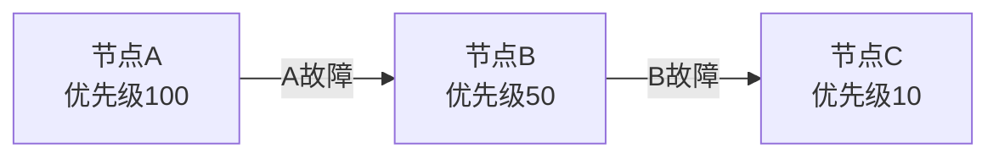
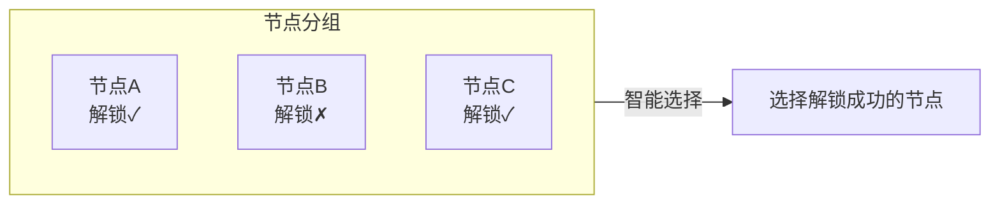
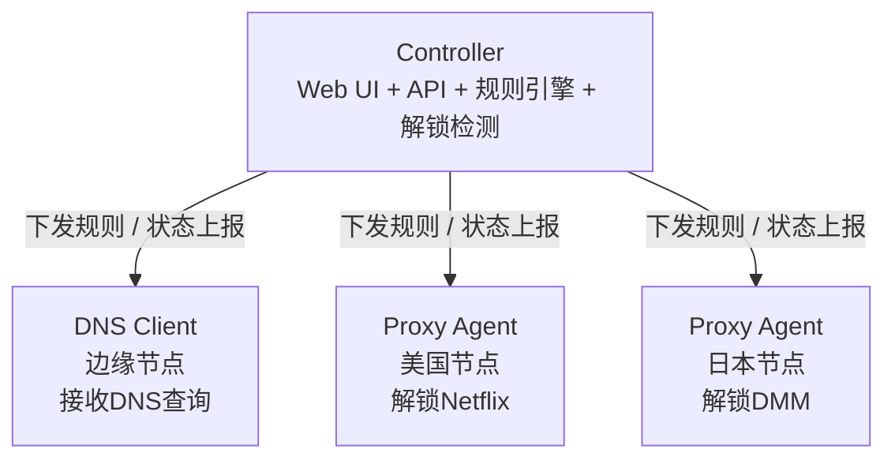

# Liquid Glass Prism Gateway

Prism-Gateway 是一个基于 DNS 的分流规则管理面板。轻量，非侵入式部署，支持智能流媒体解锁和 AI 服务解锁检测。采用 Liquid Glass 风格 UI。

[English](README_EN.md) | 中文

## 🌐 快速体验

**在线演示**: [https://prism.ciii.club](https://prism.ciii.club)

> 无需安装，直接体验完整功能

## 💬 加入讨论

**Telegram 群组**: [https://t.me/Prism_Gateway](https://t.me/Prism_Gateway)

## 功能特性

### 核心功能

- **智能 DNS 路由** - 根据域名规则将流量路由到不同 Proxy Agent
- **外部规则集支持** - 支持导入外部规则集文件，快速配置常用服务
- **流媒体解锁检测** - 自动检测 Netflix、Disney+、HBO Max 等 20+ 服务的解锁状态
- **AI 服务解锁检测** - 自动检测 OpenAI、Claude、Gemini、Copilot 等 AI 服务的可用状态
- **双栈 IPv4/IPv6** - 完整支持双协议
- **实时监控** - 基于 SSE 的节点状态实时更新
- **现代 UI** - Liquid Glass 设计风格，支持深色模式

### 路由模式

本项目支持灵活的节点分组和路由策略：

#### Group (节点分组)

将多个 Proxy Agent 组成一个分组，每个节点可设置优先级（数值越大优先级越高）。分组内支持两种选择策略：

| 组内策略 | 说明 |
|----------|------|
| **Smart** | 智能选择 - 在组内自动选择解锁状态最佳的节点 |
| **Fallback** | 故障转移 - 按组内优先级从高到低尝试，当前节点失败时自动切换到下一个 |

#### 优先级规则

优先级按数值从大到小排序：

```
优先级 100 (最高) → 优先级 50 → 优先级 10 → 优先级 1 (最低)
```

#### 工作原理

**Fallback 模式**：按优先级从高到低依次尝试



**Smart 模式**：自动选择解锁状态最佳的节点



**示例场景**：
- **Fallback 模式**：优先级 100 > 50 > 10，优先使用最高优先级节点，故障时依次降级
- **Smart 模式**：自动检测组内所有节点的解锁状态，选择解锁成功的节点

### 解锁检测

自动检测以下服务的解锁状态：

**流媒体服务**
- Netflix, Disney+, HBO Max, Amazon Prime Video
- Hulu, Paramount+, Peacock, Discovery+
- YouTube Premium, Spotify, Apple TV+
- BBC iPlayer, ITV, Channel 4, Channel 5
- 以及更多...

**AI 服务**
- OpenAI (ChatGPT)
- Anthropic (Claude)
- Google (Gemini)
- GitHub Copilot
- 以及更多...

## 安装

### 一键安装 (推荐)

```bash
wget -O install.sh https://raw.githubusercontent.com/mslxi/Liquid-Glass-Prism-dns/main/install.sh && sudo bash install.sh
```

脚本提供以下选项：
- **1. 安装** - 首次安装，完成后显示登录密码
- **2. 升级** - 升级到最新版本，保留配置
- **3. 卸载** - 完全卸载并清理数据

安装完成后：
- Web 界面：`http://你的IP:端口`
- 用户名：`admin`
- 密码：安装完成时显示

### 手动安装

从 [Releases](https://github.com/mslxi/Liquid-Glass-Prism-dns/releases) 下载对应平台的二进制文件。

```bash
# 下载
wget https://github.com/mslxi/Liquid-Glass-Prism-dns/releases/latest/download/prism-controller-linux-amd64
chmod +x prism-controller-linux-amd64
mkdir -p /opt/prism
mv prism-controller-linux-amd64 /opt/prism/prism-controller

# 创建环境文件
echo "JWT_SECRET=$(openssl rand -hex 16)" > /opt/prism/.env

# 运行
cd /opt/prism && ./prism-controller --host 0.0.0.0 --port 8080
```

## Agent 安装

在节点服务器上安装 Agent：

```bash
curl -sL https://raw.githubusercontent.com/mslxi/Liquid-Glass-Prism-dns/main/agent_install.sh | bash -s -- --master <Controller地址> --secret <节点密钥>
```

**参数说明**:

| 参数 | 说明 | 适用节点 |
|------|------|----------|
| `--master` | Controller 的地址，例如 `http://192.168.1.1:8080` | 所有节点 |
| `--secret` | 在 Controller 中创建节点时生成的密钥 | 所有节点 |
| `--smart` | 启用智能解锁检测模式 | 仅 DNS Client |
| `--beta` | 使用 Beta 版本 | 所有节点 |

## 架构



| 组件 | 描述 |
|------|------|
| **Controller** | 中央控制器，提供 Web UI、API、规则引擎和解锁检测 |
| **DNS Client** | 边缘节点，接收 DNS 查询，根据规则转发到对应 Proxy Agent |
| **Proxy Agent** | 出口节点，转发流量到目标服务器，上报解锁状态。支持嵌套解锁：若 VPS 商家提供 DNS 解锁服务，该 VPS 可作为 Proxy Agent 为其他 DNS Client 提供代理 |

## 使用流程

1. **安装 Controller** - 在中央服务器上安装
2. **创建节点** - 在 Web UI 中创建 DNS Client 和 Proxy Agent 节点
3. **安装 Agent** - 在各节点服务器上安装 Agent
4. **配置规则** - 创建 DNS 规则，选择路由模式和目标节点
5. **开始使用** - 将客户端 DNS 指向 DNS Client 节点

## 服务管理

```bash
# 查看状态
sudo systemctl status prism-controller

# 重启服务
sudo systemctl restart prism-controller

# 查看日志
journalctl -u prism-controller -f
```

## 许可证

MIT
