# Liquid Glass Prism Gateway

Prism-Gateway is a lightweight, non-intrusive DNS-based traffic routing management panel. It supports streaming unlock and smart AI services unlock detection. Features a beautiful Liquid Glass-inspired UI.

[中文](README.md) | English

## 🌐 Live Demo

**Try it now**: [https://prism.ciii.club](https://prism.ciii.club)

> No installation required, experience all features instantly

## 💬 Join the Community

**Telegram Group**: [https://t.me/Prism_Gateway](https://t.me/Prism_Gateway)

## Features

### Core Features

- **Smart DNS Routing** - Route traffic through different Proxy Agents based on domain rules
- **External Ruleset Support** - Import external ruleset files for quick configuration of common services
- **Streaming Unlock Detection** - Auto-detect unlock status for Netflix, Disney+, HBO Max, and 20+ services
- **AI Services Unlock Detection** - Auto-detect availability of OpenAI, Claude, Gemini, Copilot and other AI services
- **Dual-Stack IPv4/IPv6** - Full support for both protocols
- **Real-time Monitoring** - SSE-based live node status updates
- **Modern UI** - Liquid Glass design with dark mode support

### Routing Modes

This project supports flexible node grouping and routing strategies:

#### Group (Node Grouping)

Combine multiple Proxy Agents into a group, each node can have a priority (higher value = higher priority). Two selection strategies are supported within a group:

| Strategy | Description |
|----------|-------------|
| **Smart** | Intelligent Selection - Automatically choose the node with best unlock status within the group |
| **Fallback** | Failover - Try nodes from highest to lowest priority, switch to next when current fails |

#### Priority Rules

Priority is sorted by value from high to low:

```
Priority 100 (Highest) → Priority 50 → Priority 10 → Priority 1 (Lowest)
```

#### How It Works

**Fallback Mode**: Try nodes from highest to lowest priority


**Smart Mode**: Automatically select the node with best unlock status

```mermaid
flowchart LR
    subgraph Group[Node Group]
        A[Node A<br/>Unlocked ✓]
        B[Node B<br/>Locked ✗]
        C[Node C<br/>Unlocked ✓]
    end
    Group -->|Smart Select| D[Choose unlocked node]
```



**Example Scenarios**:
- **Fallback Mode**: Priority 100 > 50 > 10, prefer highest priority node, degrade sequentially on failure
- **Smart Mode**: Auto-detect unlock status of all nodes in group, select the one that is unlocked

### Unlock Detection

Automatically detect unlock status for the following services:

**Streaming Services**
- Netflix, Disney+, HBO Max, Amazon Prime Video
- Hulu, Paramount+, Peacock, Discovery+
- YouTube Premium, Spotify, Apple TV+
- BBC iPlayer, ITV, Channel 4, Channel 5
- And more...

**AI Services**
- OpenAI (ChatGPT)
- Anthropic (Claude)
- Google (Gemini)
- GitHub Copilot
- And more...

## Installation

### One-Click Install (Recommended)

```bash
curl -sL https://raw.githubusercontent.com/mslxi/Liquid-Glass-Prism-dns/main/install.sh | sudo bash
```

The script provides the following options:
- **1. Install** - Fresh installation, displays login password upon completion
- **2. Upgrade** - Upgrade to latest version, preserves configuration
- **3. Uninstall** - Complete removal with data cleanup

After installation:
- Web UI: `http://YOUR_IP:PORT`
- Username: `admin`
- Password: Displayed after installation

### Manual Installation

Download the binary for your platform from [Releases](https://github.com/mslxi/Liquid-Glass-Prism-dns/releases).

```bash
# Download
wget https://github.com/mslxi/Liquid-Glass-Prism-dns/releases/latest/download/prism-controller-linux-amd64
chmod +x prism-controller-linux-amd64
mkdir -p /opt/prism
mv prism-controller-linux-amd64 /opt/prism/prism-controller

# Create environment file
echo "JWT_SECRET=$(openssl rand -hex 16)" > /opt/prism/.env

# Run
cd /opt/prism && ./prism-controller --host 0.0.0.0 --port 8080
```

## Agent Installation

Install Agent on node servers:

```bash
curl -sL https://raw.githubusercontent.com/mslxi/Liquid-Glass-Prism-dns/main/agent_install.sh | bash -s -- --master <Controller_URL> --secret <Node_Secret>
```

**Parameters**:

| Parameter | Description | Applicable Nodes |
|-----------|-------------|------------------|
| `--master` | Controller URL, e.g., `http://192.168.1.1:8080` | All nodes |
| `--secret` | Node secret generated when creating node in Controller | All nodes |
| `--smart` | Enable smart unlock detection mode | DNS Client only |
| `--beta` | Use beta version | All nodes |

## Architecture


| Component | Description |
|-----------|-------------|
| **Controller** | Central controller with Web UI, API, rule engine and unlock detection |
| **DNS Client** | Edge node that receives DNS queries, forwards to corresponding Proxy Agent based on rules |
| **Proxy Agent** | Exit node that forwards traffic to target servers, reports unlock status. Supports nested unlocking: if a VPS provider offers DNS unlock service, that VPS can serve as a Proxy Agent to provide proxy for other DNS Clients |

## Workflow

1. **Install Controller** - Install on central server
2. **Create Nodes** - Create DNS Client and Proxy Agent nodes in Web UI
3. **Install Agents** - Install Agent on each node server
4. **Configure Rules** - Create DNS rules, select routing mode and target nodes
5. **Start Using** - Point client DNS to DNS Client node

## Service Management

```bash
# Check status
sudo systemctl status prism-controller

# Restart service
sudo systemctl restart prism-controller

# View logs
journalctl -u prism-controller -f
```

## 📸 Screenshots


